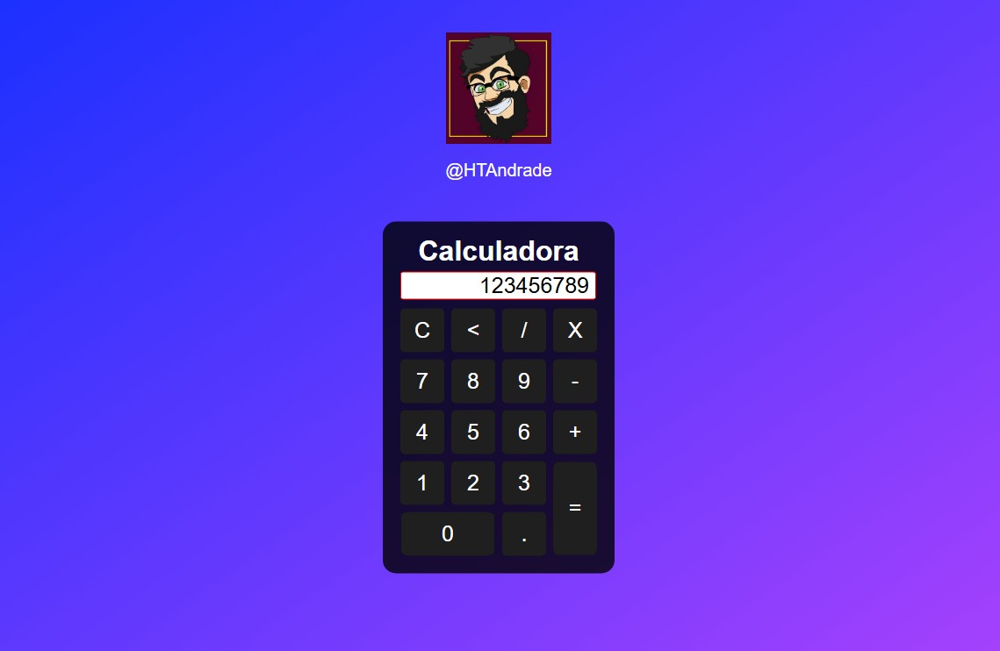

<h1 align="center"> Calculator 1.0 </h1>

Calculadora produzida para estudo de programação Front-End

  <a href="#-tecnologias">Tecnologias</a>&nbsp;&nbsp;&nbsp;|&nbsp;&nbsp;&nbsp;
  <a href="#-projeto">Projeto</a>&nbsp;&nbsp;&nbsp;

  

 

## 🚀 Tecnologias

Esse projeto foi desenvolvido com as seguintes tecnologias:

- HTML e CSS
- JavaScript (em construção)
- Git e Github

## 💻 Projeto

Esta calculadora é uma forma de calcular rapidamente operações simples de matemática.

---

Feito com ♥ by Hugo Andrade.